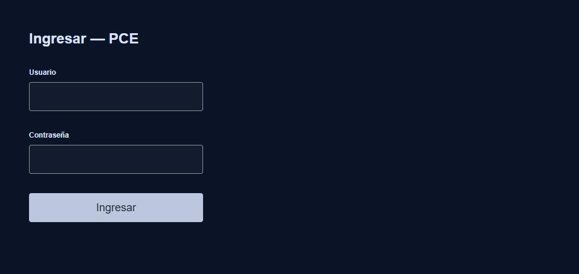
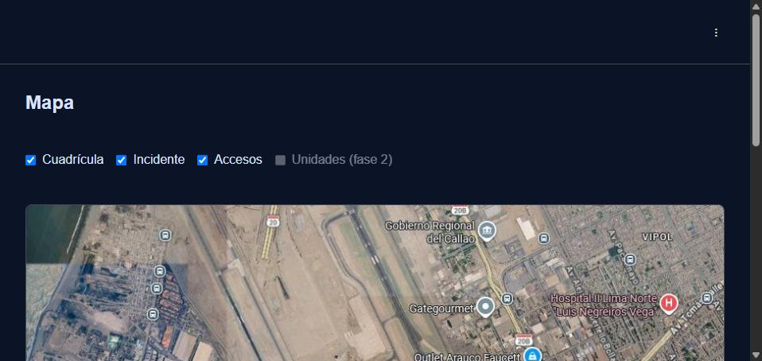
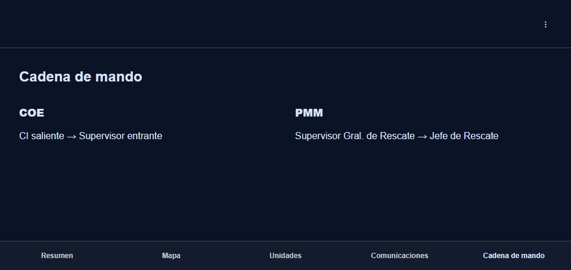
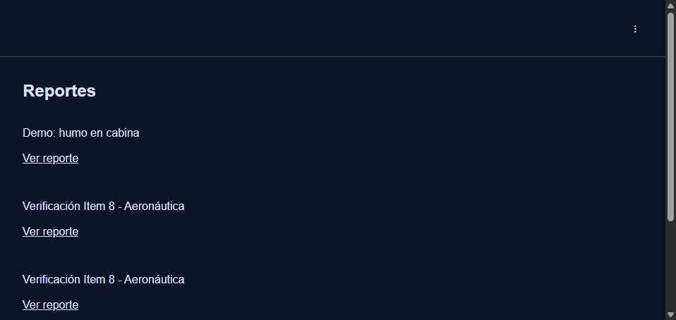
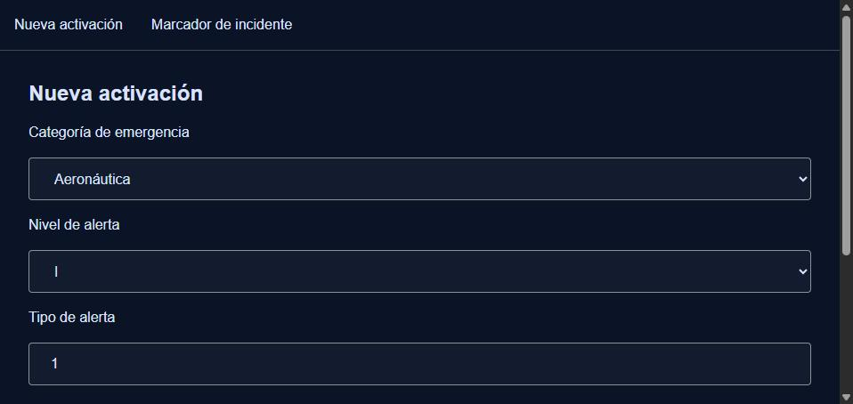
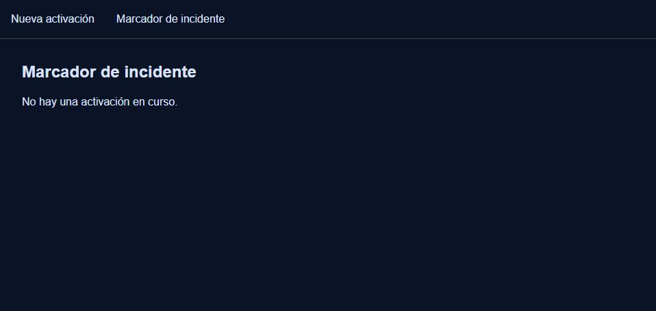

# Manual de Usuario — PCE (Puesto de Comando y Administración de Emergencias)

**SSEI, Aeropuerto Internacional Jorge Chávez**

Versión 1.0 — 2026-08-19

---

## 1. Qué es el PCE

El PCE es el sistema que reemplaza el registro en papel de las emergencias del aeropuerto.
Tiene **dos aplicaciones separadas**, cada una pensada para un contexto distinto:

| Aplicación | Para quién | Dónde se usa | Funciona sin internet |
|---|---|---|---|
| **Cliente COE** | Supervisores de COE, Gerencia de Seguridad/Operaciones, Duty Manager | Navegador de escritorio, en el Centro de Operaciones de Emergencia | No |
| **Cliente PMM** | Personal de Rescate en campo (CI, M4, M7, Supervisores de Rescate) | Tablet GETAC, en el lugar del incidente | Sí — sigue funcionando sin señal y sincroniza solo al reconectar |

Ambas aplicaciones hablan con el mismo sistema por detrás: lo que se registra desde la
tablet en el lugar del incidente aparece automáticamente en las pantallas del COE, sin
que nadie tenga que transcribir nada.

**URLs de acceso:**

- Cliente COE: `https://pce-jorge-chavez.web.app`
- Cliente PMM: `https://pce-jorge-chavez-pmm.web.app`

---

## 2. Ingresar al sistema

Ambos clientes usan la misma pantalla de login: usuario y contraseña.

**No hay forma de crear tu propia cuenta desde la app.** Las cuentas las da de alta un
administrador del sistema (rol `admin`) — si todavía no tenés usuario, pedile a la persona
encargada de la administración del PCE que te cree uno, indicándole tu nombre, tu rol
dentro del Plan de Emergencia, y si tu instancia principal es COE o PMM.

**Si tu sesión se corta sola después de un rato**: es normal, es una medida de seguridad
(la sesión expira sola). Volvé a ingresar con tu usuario y contraseña — no perdés ningún
dato que ya hayas enviado.

**Cliente PMM — atajo al reabrir la app**: si ya iniciaste sesión antes en esa tablet, la
próxima vez que abrís la app no te vuelve a pedir usuario y contraseña (siempre que la
sesión siga vigente) — arranca directo donde la dejaste, incluso sin señal.

---

## 3. Cliente COE

Al ingresar, vas a ver una barra de pestañas abajo de la pantalla: **Resumen**, **Mapa**,
**Unidades**, **Comunicaciones**, **Cadena de mando**. Dos acciones — **Relevo de mando** y
**Desactivar** — están siempre visibles como botones flotantes, sin importar en qué pestaña
estés.

### 3.1. Resumen

Es la pantalla de entrada mientras hay una emergencia activa: muestra el nivel de alerta,
un cronómetro desde que se registró el incidente, cuántas personas de la convocatoria ya
confirmaron (COE y PMM), y un feed con los últimos eventos registrados. Se actualiza sola
cada pocos segundos, no hace falta recargar la página.

**Si no hay ninguna activación en curso**, el sistema te lleva directo a la pestaña
**Cadena de mando** en su lugar — no tiene sentido mostrar un resumen vacío.

### 3.2. Mapa

Vista de solo lectura sobre la foto satelital del aeropuerto, con 3 capas que podés
prender o apagar con los checkboxes de arriba:

- **Cuadrícula** — la referencia de cuadrícula del mapa físico en papel.
- **Incidente** — los marcadores del incidente en curso.
- **Accesos** — puntos de acceso relevantes.

Los marcadores que ve acá son los que el personal de Rescate registra desde la tablet
(Cliente PMM, sección 4.3) — se ubican solos usando la posición GPS capturada en el
momento.

### 3.3. Unidades

Lista de las unidades operativas (R1, R2, R8-R13, CR9). Cada fila tiene un desplegable
para cambiar el estado:

- **OK**
- **Fuera de servicio**
- **No aplica**

El cambio se guarda apenas lo seleccionás — no hace falta un botón aparte de "Guardar". La
lista muestra la hora de la última actualización de cada unidad.

### 3.4. Comunicaciones

Esta pestaña todavía no tiene funcionalidad — es un espacio reservado para una futura
versión del sistema. Por ahora no hay nada que hacer ahí.

### 3.5. Cadena de mando

Muestra, en dos columnas (COE y PMM), quién relevó a quién a lo largo de la emergencia —
el historial completo de relevos de mando de la activación en curso.

### 3.6. Pre-PAI (menú aparte)

No está en la barra de pestañas principal — se accede desde el menú de tres puntos, arriba
a la derecha. Lista los Pre-PAI (planes de acción inmediata pre-armados por escenario) y
permite ver el detalle de cada uno: sector, tipo de emergencia, riesgos, contactos,
recursos y estrategias de control. Es de **solo lectura** — no se edita ni se "activa"
desde el Cliente COE.

### 3.7. Reportes (menú aparte)

Lista todas las activaciones ya cerradas. Al tocar **Ver reporte** en cualquiera, se genera
(o se muestra, si ya existía) el reporte de cierre de esa emergencia, con los datos que el
sistema pudo completar automáticamente a partir de lo registrado durante la activación.

> **Ojo**: no todas las columnas del reporte se completan solas — el esquema sigue el
> formato real de los 4 "Cuadro Estadístico de Emergencias..." que Rescate ya usa en Excel,
> y varias columnas son detalle operativo que el PCE todavía no captura (quedan en blanco,
> a completar a mano).

**Descargar el Excel consolidado**: existe un exportador que arma un `.xlsx` con todos los
reportes de cierre ya generados de una categoría (Aeronáutica, Epidemiológica,
Estructural/Incidentes o MATPEL) — pensado para reemplazar el Excel que Rescate arma a
mano. Todavía no tiene un botón en esta pantalla; hoy lo baja alguien del equipo técnico
con acceso al backend (`GET /reportes-cierre/exportar?tipo_emergencia=...`, requiere sesión
autenticada). Si esto se usa seguido, vale la pena pedir que se agregue un botón acá.

### 3.8. Relevo de mando (botón flotante)

Disponible en cualquier pestaña. Abre un formulario corto: elegís la instancia (COE o
PMM), quién sale y quién entra, y confirmás. Solo lo pueden usar ciertos roles (Jefe de
Rescate, Sup. Gral./Supervisor de Rescate, Gerente de Seguridad, Gerente de Operaciones
Aeroportuarias, Duty Manager) — si tu rol no está en esa lista, el botón no hace nada
visible para vos.

### 3.9. Desactivar (botón flotante)

También disponible en cualquier pestaña. Pide confirmación ("¿Confirmás desactivar
[nombre del incidente]?") antes de cerrar la activación en curso. Solo lo pueden usar
Gerente de Seguridad, Gerente de Operaciones Aeroportuarias o Duty Manager. Al confirmar,
el reporte de cierre de esa activación se genera automáticamente — no hace falta ir
aparte a la pestaña Reportes y pedirlo.

---

## 4. Cliente PMM

Pensado para usarse en la tablet GETAC, en el lugar del incidente, con o sin señal. La
navegación es más simple: una barra de pestañas arriba con las pantallas disponibles para
tu rol.

### 4.1. Iniciar sesión sin conexión

Si ya ingresaste antes en esa tablet, la app reabre tu sesión guardada sin necesidad de
señal — podés seguir trabajando aunque no haya conexión.

### 4.2. Nueva activación

Así se registra una emergencia nueva:

1. **Categoría de emergencia**: Aeronáutica, Epidemiológica, Estructural/Incidentes o
   MATPEL (Aeronáutica viene preseleccionada).
2. Según la categoría elegida, cambian los campos siguientes:
   - **Aeronáutica**: Nivel de alerta (I/II/III) y Tipo de alerta (número).
   - **Epidemiológica**: Clasificación (Emergencia / Urgencia / Consulta).
   - **Estructural/Incidentes**: Clasificación (Estructural / Incidente).
   - **MATPEL**: Clasificación (una de las 9 clases UN de materiales peligrosos).
3. **Tipo de incidente**: una descripción corta en texto libre.
4. Tocá **Activar**.

La convocatoria de COE y PMM se arma sola al enviar — no hay que avisar manualmente a
nadie, el sistema calcula quién debe ser convocado según la categoría y el nivel.

**Si no hay señal en ese momento**, la pantalla te avisa "Activación sin sincronizar" — ya
quedó guardada en la tablet y se va a enviar sola apenas haya conexión. Podés seguir
trabajando con normalidad.

### 4.3. Marcador de incidente

Registra un punto en el mapa. Apenas abrís la pantalla, la tablet intenta capturar tu
posición por GPS automáticamente:

- Si el GPS funciona, ves "Posición GPS: [coordenadas]" — podés tocar **Volver a capturar
  posición** si te moviste.
- Si el GPS falla (por ejemplo, dentro de un edificio) o el dispositivo no tiene GPS, te
  pide ingresar la coordenada de cuadrícula a mano, igual que con el mapa en papel — nunca
  te deja sin forma de registrar el marcador.

Completá **Tipo de incidente**, opcionalmente **Riesgo**, y elegí a qué **Capa** pertenece
(Cuadrícula, Incidente o Accesos). Tocá **Registrar marcador**. Este marcador va a aparecer
solo en el Mapa del Cliente COE (sección 3.2).

> Esta pantalla solo funciona si hay una activación en curso — si no la hay, te avisa "No
> hay una activación en curso" en vez de mostrar el formulario.

### 4.4. Evaluación inicial

Solo visible/editable para CI, Supervisores de Rescate, Gerente de Seguridad, Gerente de
Operaciones Aeroportuarias o Duty Manager — si tu rol no está en esa lista, la pantalla te
avisa que tu rol no puede completarla. Se registra la **Magnitud** del incidente y,
opcionalmente, **Riesgos secundarios**. Igual que el Marcador, necesita una activación en
curso para poder usarse.

### 4.5. Relevo de mando

Mismo formulario que en el Cliente COE (sección 3.8): instancia, responsable saliente,
responsable entrante. Restringido a los mismos roles que la Evaluación inicial.

### 4.6. Qué pasa si te quedás sin conexión

Este es el comportamiento más importante para entender del Cliente PMM:

- **Nunca perdés lo que registraste.** Nueva activación, Evaluación inicial, Marcador de
  incidente y Relevo de mando se guardan en la tablet apenas los enviás, tengas señal o no.
- El `Shell` de la app muestra un contador ("N sin sincronizar") con cuántos registros
  están esperando para enviarse.
- Apenas la tablet recupera señal, esos registros se envían solos, en el mismo orden, sin
  duplicarse aunque el envío se reintente.
- **Ventana de sesión offline: 24 horas.** Si pasás más de 24 horas sin conexión, al
  reconectar la app te va a pedir volver a loguearte antes de terminar de sincronizar — es
  una medida de seguridad, no perdés lo que ya registraste (queda guardado en la tablet
  hasta que vuelvas a entrar).

---

## 5. Roles y qué puede hacer cada uno

| Rol | Puede editar Evaluación inicial / Relevo de mando | Puede Desactivar una activación | Puede gestionar usuarios |
|---|:---:|:---:|:---:|
| `admin` | No | No | Sí |
| Jefe de Rescate | Sí | No | No |
| Sup. Gral. de Rescate | Sí | No | No |
| Supervisor de Rescate | Sí | No | No |
| Gerente de Seguridad | Sí | Sí | Sí |
| Gerente Operaciones Aeroportuarias | Sí | Sí | Sí |
| Duty Manager | Sí | Sí | Sí |
| M4 / M7 / SGO / Bombero Aeronáutico / Servicio Médico | No | No | No |
| Supervisores de COE (Seguridad Patrimonial, de la Aviación, Terminales, CCA, Operaciones Lado Aire, Ingeniero de Turno) | No | No | No |
| Gerente de Reputación / RRHH / Logística | No | No | No |

Todos los roles pueden: iniciar sesión, ver el Resumen/Mapa/Cadena de mando/Pre-PAI/
Reportes (Cliente COE), y registrar una Nueva activación o un Marcador de incidente
(Cliente PMM) — esas pantallas no tienen restricción de rol.

El rol `admin` es una cuenta técnica para dar de alta usuarios — no participa en la
convocatoria de ninguna emergencia real.

---

## 6. Preguntas frecuentes

**No puedo ingresar, me dice "Credenciales inválidas".**
Revisá usuario y contraseña. Si fallás varias veces seguidas, el sistema bloquea
temporalmente los intentos por un minuto (protección contra ataques) — esperá y volvé a
intentar con la contraseña correcta.

**Me quedé sin señal en pleno incidente, ¿pierdo lo que estaba haciendo?**
No. El Cliente PMM guarda todo localmente en la tablet y sincroniza solo al reconectar
(ver sección 4.6).

**El botón de Desactivar/Relevo de mando no hace nada cuando lo toco.**
Revisá tu rol — esas dos acciones están restringidas a un grupo específico de roles (ver
sección 5). Si creés que deberías tener acceso, hablalo con quien administra las cuentas.

**¿Cómo pido que me den de alta un usuario?**
No hay autoregistro. Contactá al administrador del sistema con tu nombre, tu rol del Plan
de Emergencia, e indicale si tu instancia principal es COE o PMM.

**¿Se puede editar o borrar un registro después de enviado?**
No. Por diseño, los registros de una emergencia (activación, evaluación inicial, relevos,
marcadores) no se pueden editar ni borrar una vez enviados — es una decisión deliberada
para que el historial de una emergencia real quede intacto. La única excepción es cerrar
("desactivar") una activación, que sí es una transición permitida.

---

## 7. Contacto

Para problemas de acceso, cuentas nuevas, o dudas sobre el funcionamiento del sistema,
contactar al equipo técnico responsable del PCE.
